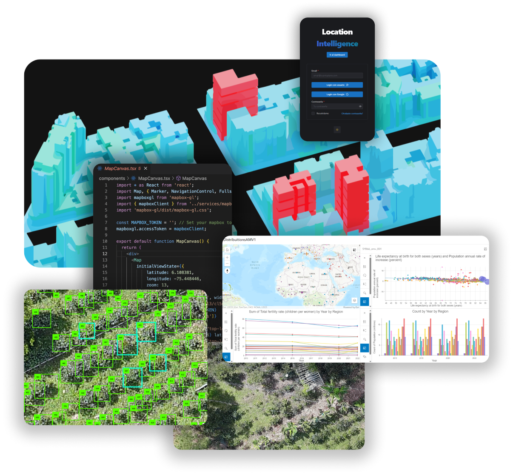

import Bleed from 'nextra-theme-docs/bleed'

<head>
  <title>Portfolio | AndresMoreno</title>
</head>

Andrés is a GIS Specialist with a background in Architecture and Urban Planning with over 10+ years of professional experience. He is a certified ArcGIS Pro Professional and is passionate about Global Development & Enterprise Mapping solutions. Andrés is also skilled in drone mapping operations and utilizing JavaScript and Python APIs for ArcGIS. On his "free time", he likes to play with CAD, BIM and GIS data (.gdb, .shp. .gltf, .dae, i3s, .ifc, ...). He was born in Medellín, studied in Seoul and currently lives in Madrid.

🌎 ESRI ArcGIS Pro Professional (EAPA2201) 
🌎 ESRI ArcGIS Pro Associate (EAPA2101) 
☁️ Microsoft Azure Certified (AZ Fundamentals and AZ Data Fundamentals) 
💻 GIS web development and mapping applications (Javascript, React, Python, REST & OpenAPIs) 

"I am passionate about the possibilities of web development and Smart Cities using GIS mapping applications." Andrés M. (at the Esri User Conference 2023)

Contact me for consulting services or to help you build your next big project: andresmorenovasquez📧outlook.com +34 687-4800-97

<Bleed></Bleed>
