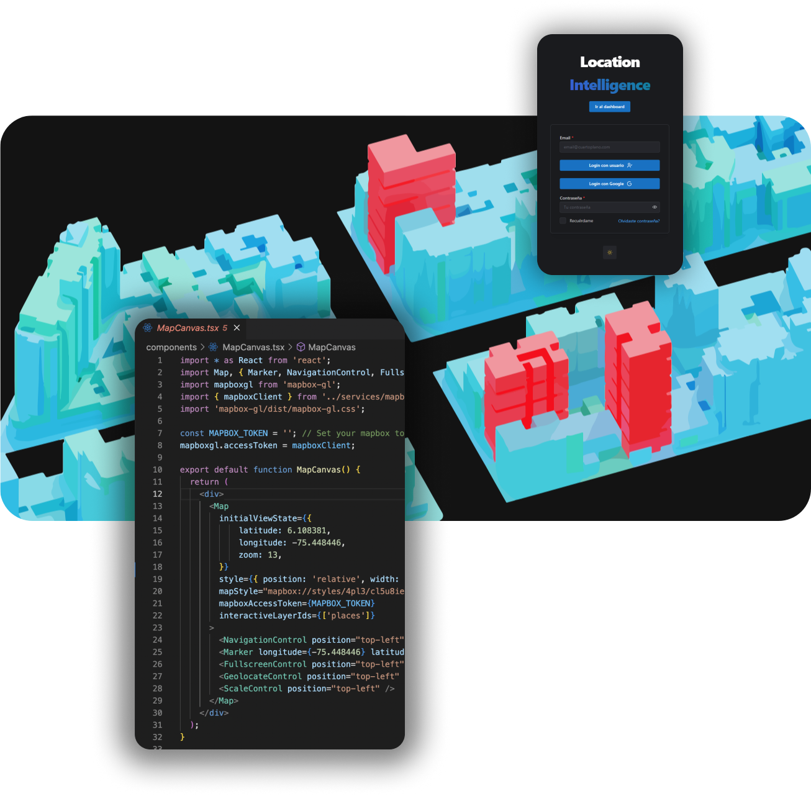

import Bleed from 'nextra-theme-docs/bleed'

<head>
  <title>Portfolio | AndrésMoreno</title>
</head>

Andrés is an architect passionate about 3D modeling and GIS digital twins.
Since 2014, he has been actively involved in GIS analysis, working with BIM/CAD & GIS data interoperability, and exploring emerging technologies. His expertise includes virtual and augmented reality, drone applications, and web development.

🌎 ESRI ArcGIS Pro Associate (EAPA2101) 
☁️ Microsoft Azure Certified (AZ Fundamentals and AZ Data Fundamentals) 
💻 GIS Web development and mapping applications 

I am passionate about the possibilities of web development and smart cities using GIS mapping applications.

Contact me for consulting services or helping you build your next big project: andresmorenovasquez📧outlook.com +34 687-4800-97

<Bleed></Bleed>
