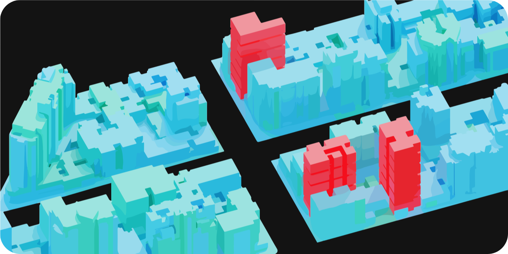

import Bleed from 'nextra-theme-docs/bleed'

# GIS urban analytics 📚 Editor (Cs) DISC type 👤 INTJ - The Thinker 🏗 Architect AEC/RED industry

**I am** a developer based in Europe (Spain) with a background in GIS analytics and the built environment.

I have a formal education in architecture & real estate valuation. I am passionate about web development and merging the AEC/RED industry with it.

<Bleed></Bleed>
