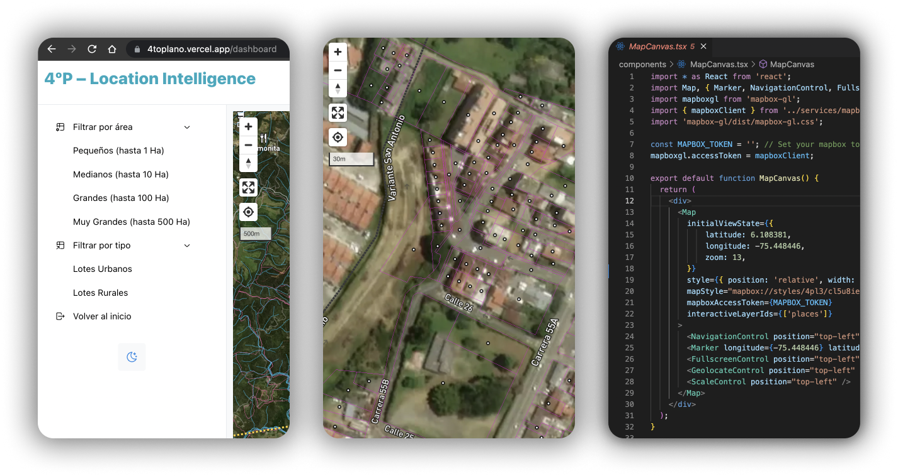

import Bleed from 'nextra-theme-docs/bleed'
import Image from 'next/image'

# Location Intelligence

I received the requirement for a web-based mapping application for Cuarto Plano, a local developer based in Colombia [Cuarto Plano Real Estate Developers](https://www.cuartoplano.com/).
They needed to filter and query good fits for their real estate developement strategies.

I used Mapbox alongside with React and NextJS on the front-end. The filtering and prospect of options was obtained exploring open databases and edited in ArcGIS and QGIS software.

You can find the project repo here: [GitHub repo](https://github.com/andriusmv/4toplano) and the live demo here: [4toplano](https://4toplano.vercel.app/)

User auth was implemented with Supabase, which is a PostgreSQL.
 
 
<Image src="/Location.png" width={1200} height={825} />
 
 

